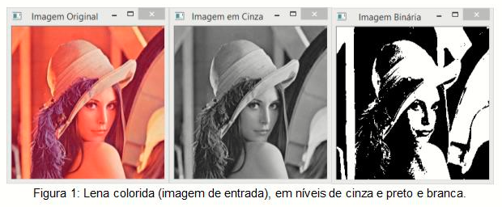

# LenaImageDim

📷 Compressão Visual com Lena: do RGB ao Binário

Este projeto faz parte do Bootcamp Dio + BairesDev e tem como objetivo aplicar técnicas de redução de dimensionalidade em imagens. A proposta é converter uma imagem da Lena colorida (RGB) em duas versões:

Escala de cinza (grayscale): transforma os pixels para tons entre 0 e 255.

Imagem binarizada (preto e branco): converte os pixels para apenas 0 ou 255 com base em um limiar (threshold).

# O que o código faz
Abre a imagem original da lena (lena.png) usando a biblioteca Pillow.
Converte manualmente cada pixel RGB para escala de cinza, usando uma fórmula.
Binariza a imagem em escala de cinza, definindo pixels com valor maior que 128 como branco (255) e os demais como preto (0).

Exibe as três imagens geradas:
  
  1. **Imagem original colorida (RGB)**


  


  2. **Escala de Cinza:**  
   Cada pixel da imagem colorida é convertido em um valor de intensidade de cinza (0 a 255), usando uma fórmula ponderada para simular a percepção humana de luminosidade. A fórmula usada para converter de RGB para escala de cinza é uma média ponderada que leva em   consideração a sensibilidade do olho humano a diferentes cores:

cinza=0.299×R+0.587×G+0.114×B
Significa que o verde tem maior peso, seguido pelo vermelho, e depois o azul.


  


  3. **Imagem Binarizada (Preto e Branco):**
A binarização é o processo de transformar uma imagem em tons de cinza em uma imagem com apenas dois valores: preto e branco. Isso é feito escolhendo um limiar (threshold), que é um valor entre 0 e 255.

A regra para binarizar cada pixel é:

pixel binarizado={ 255, se pixel cinza>threshold
                 {   0, caso contrário
​

  

No projeto, usamos um limiar padrão de 128, ou seja, pixels com valor maior que 128 viram branco (255), e os demais viram preto (0).
As imagens de saída lena_gray.png e lena_binary.png são salva na mesma pasta da imagem original.


## Como usar

1. Coloque a imagem `lena.png` na pasta do projeto.
2. Instale a biblioteca Pillow, se ainda não tiver:

   ```bash
   pip install Pillow

Execute o script Python:
python projeto_lena.py
  
